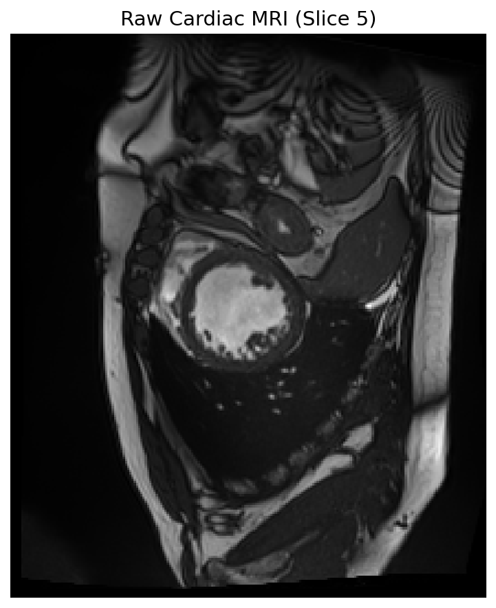
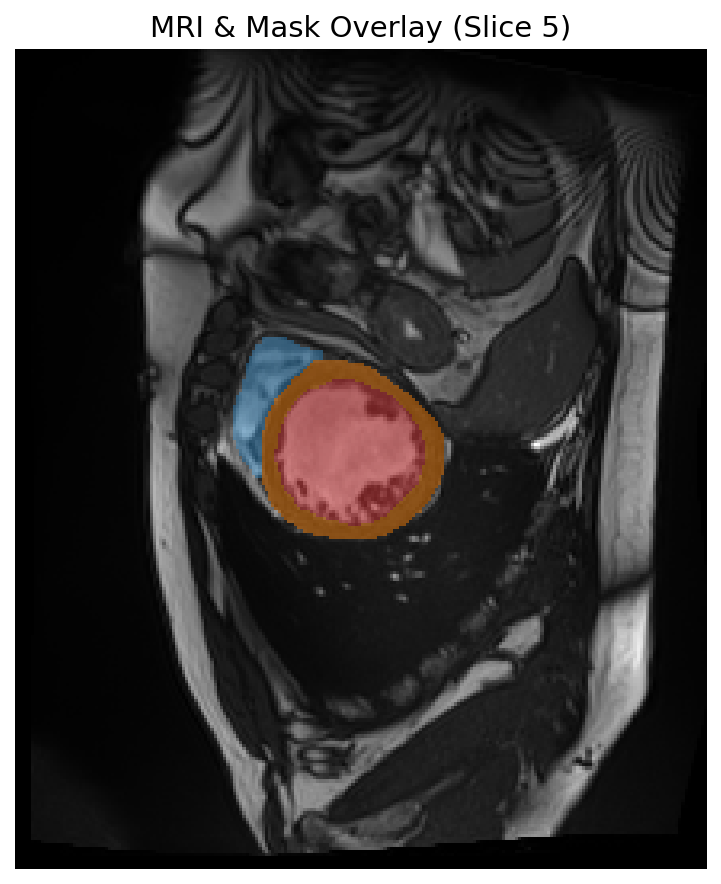

# 🫀 비전공자를 위한 심장 MRI 분할 & 임상 분석 가이드

이 문서는 의료 및 의학 분야가 낯선 비전공자도 **"우리가 이 프로젝트로 무엇을 해결하고자 하며, 데이터 파일 안에 무엇이 들어있는지"**를 한눈에 이해할 수 있도록 쉽게 풀어 쓴 안내서입니다.

---

## 1. 뼈대 이해하기: 심장의 기본 구조와 3대 핵심 타겟

우리가 개발할 인공지능(AI)은 심장 MRI 사진을 보고 **심장의 특정 부위 3곳**을 자동으로 구분해서 색칠하는 법을 배웁니다. 아래 사진의 색상 부위들이 인공지능이 찾아내야 할 타겟입니다.

| 부위 명칭 | 의학 용어 | 마스크 번호 | 역할 (아주 쉬운 설명) |
| :--- | :--- | :--- | :--- |
| **우심실** | Right Ventricle (RV) | **1번 (파란색)** | 몸을 돌고 온 피를 받아 **폐(Lung)로 뿜어내어 산소를 받아오게 하는 펌프**입니다. |
| **심근** | Myocardium (MYO) | **2번 (주황색)** | 심장을 둘러싸고 있는 **단단한 근육 벽**입니다. 이 근육이 수축과 이완을 하며 피를 뿜어냅니다. |
| **좌심실** | Left Ventricle (LV) | **3번 (빨간색)** | 폐에서 산소를 충전한 피를 받아 **온몸(뇌, 장기 등)으로 뿜어내 주는 가장 힘센 핵심 펌프**입니다. |

---

## 2. 우리가 다룰 데이터 눈으로 직접 보기

3D NIfTI(`patient001_frame01.nii.gz`) 파일에서 심장 부위가 가장 잘 보이는 중간 단면(Slice 5)을 추출하여 그림으로 변환한 결과입니다.

### 🖼️ MRI 단면 분석

```carousel

<!-- slide -->

<!-- slide -->

```

### 🔍 그림 속 심장 찾아보기 (3번 Overlay 그림 기준)
* **가운데 빨간색 동그라미(3번, LV)**: 이것이 좌심실 안쪽의 피가 차 있는 방입니다.
* **빨간색을 도넛처럼 감싸고 있는 주황색 띠(2번, MYO)**: 이것이 좌심실을 움직이는 심장 근육(심근)입니다.
* **왼쪽(실제 환자의 오른쪽 몸 기준)에 붙어 있는 파란색 초승달 모양(1번, RV)**: 이것이 우심실입니다.

인공지능은 **1번(순수 MRI)**을 입력받아 **3번(정답 레이어)**처럼 각 픽셀이 우심실(파란색), 심근(주황색), 좌심실(빨간색) 중 어디에 속하는지 정확하게 예측해야 합니다.

---

## 3. 핵심 의학 용어 & 임상 지표 설명

의사들이 이 영상 분석 결과를 가지고 환자의 심장 건강을 진단할 때 쓰는 핵심 지표들입니다.

### ① 이완기 끝 (End-Diastole, ED)과 수축기 끝 (End-Systole, ES)
심장은 계속 수축하고 이완하며 움직이는 동적인 장기입니다.
* **이완기 끝 (ED)**: 심장에 피가 가득 차서 **가장 풍선처럼 부풀어 올랐을 때**의 시점입니다. (MRI 상에서 빨간색 면적이 가장 넓음)
* **수축기 끝 (ES)**: 심장이 피를 밖으로 다 쥐어짜서 **가장 쪼그라들었을 때**의 시점입니다. (MRI 상에서 빨간색 면적이 가장 좁음)

> **💡 왜 이 두 프레임만 보나요?**
> 심장의 펌프 성능을 계산하려면 **"가장 컸을 때의 부피"**와 **"가장 작아졌을 때의 부피"**만 알면 되기 때문입니다.

### ② 박출률 (Ejection Fraction, EF)
심장이 한 번 뛸 때 **좌심실에서 몸 전체로 내보내는 피의 비율(%)**을 의미하며, 심장 기능 평가의 **가장 중요한 척도**입니다.
* **계산 공식**: 
  $$\text{박출률(EF, \%)} = \frac{\text{이완기 부피(EDV)} - \text{수축기 부피(ESV)}}{\text{이완기 부피(EDV)}} \times 100$$
* **예시**: 가장 커졌을 때(EDV) 피가 100ml였는데, 꽉 짜서 작아졌을 때(ESV) 40ml가 남았다면, 60ml를 내보낸 것이므로 박출률은 **60%**입니다.
* **임상적 의미**: 
  * **55% ~ 70%**: 정상 건강한 심장
  * **40% 이하**: 심장이 피를 제대로 짜내지 못하는 **심부전(Heart Failure)** 상태로 판정

### ③ 심근 질량 (Myocardial Mass)
심장 근육(주황색 띠)의 실제 무게(g 단위)입니다.
* 심장이 좋지 않아 억지로 힘을 많이 쓰다 보면 심장 근육이 헬스 근육처럼 비정상적으로 두꺼워지는데, 이를 **심근비대증**이라고 합니다.
* 인공지능이 주황색 띠의 전체 부피를 계산하고, 여기에 심근의 평균 밀도인 **$1.05 \text{ g/ml}$**를 곱해 심장 근육의 총 무게를 계산합니다.

---

## 4. 왜 NIfTI (.nii.gz) 포맷이 중요하고, 어떻게 부피를 계산하나요?

일반적인 사진 파일(JPEG, PNG)은 단순히 픽셀 개수만 알 수 있지만, 의료 영상인 NIfTI 파일은 헤더(Header)라는 메타데이터 저장소에 **"복셀 간격(Voxel Spacing)"**이라는 물리적 정보를 담고 있습니다.

* **복셀(Voxel)**: 3차원 공간에서 픽셀(Pixel) 하나가 차지하는 부피 단위입니다.
* **복셀 간격(Spacing)**: 가로, 세로, 두께가 실제 환자 몸 안에서 몇 mm인지를 나타냅니다.
  * 우리가 분석한 데이터의 스펙: `dx = 1.5625 mm` (가로), `dy = 1.5625 mm` (세로), `dz = 10.0000 mm` (두께)
  * 복셀 1개의 실제 부피 = $1.5625 \times 1.5625 \times 10.0 = 24.414 \text{ mm}^3 = 0.0244 \text{ ml}$
* **부피 환산 방식**: 인공지능이 좌심실(빨간색)로 판단한 3차원 복셀 개수가 총 5,000개라면,
  $$\text{좌심실 실제 부피} = 5,000 \times 0.0244 \text{ ml} = 122 \text{ ml}$$
  이 방식을 통해 단순히 픽셀 정확도를 맞추는 차원을 넘어, **실제 의사들이 진단에 쓸 수 있는 부피 데이터(ml)**를 온전히 뽑아낼 수 있게 됩니다.

---

이 문서를 통해 프로젝트의 의학적 가치와 가동 원리를 이해하시는 데 도움이 되었기를 바랍니다. 준비되셨을 때 다음 지시를 내려주시면 감사하겠습니다!
