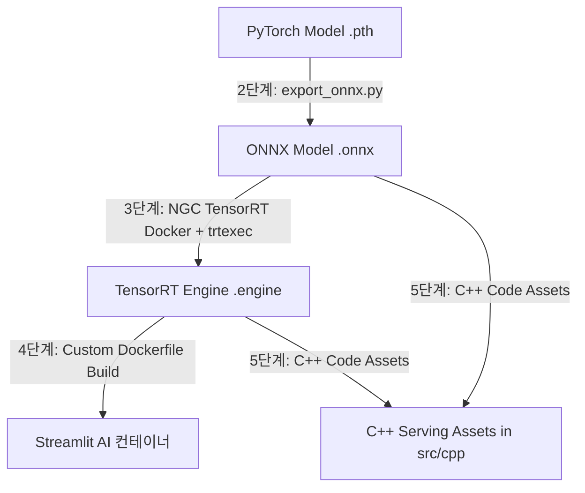

# 🫀 CardioSeg3D MLOps 및 배포 파이프라인 구축 계획 (CardioSeg_Deployment_Plan.md)

본 계획서는 CardioSeg3D 프로젝트를 연구용 PyTorch 코드 베이스에서 상용 등급의 **임상 배포 파이프라인(MLOps & Serving Pipeline)**으로 전환하기 위한 구체적인 기술 로드맵입니다.



---

## 📅 MLOps 배포 로드맵 요약

1. **[2단계] ONNX 포맷 변환 및 정밀도 검증 (완료 🟢)**
   * PyTorch 가중치(`best_metric_model_hr.pth`) ➡️ `best_metric_model_hr.onnx` 변환.
   * `onnx.checker` 무결성 확인 및 PyTorch 대비 ONNX 출력 오차율 검증 (MAE: `5.24e-06`).
2. **[3단계] TensorRT 가속화 및 FP16 양자화 (완료 🟢)**
   * 공식 NGC TensorRT 도커 이미지(`nvcr.io/nvidia/tensorrt:23.08-py3`) 활용.
   * Dynamic Shape Profile(`1x1x128x128x8` ~ `1x1x128x128x32`) 주입을 통한 형상 충돌 해결.
   * RTX 4070 Ti 기준 **평균 지연 시간 0.88ms (1080.6 QPS)** 가속 성공.
3. **[4단계] 전체 가동 환경 자체 Docker 배포 패키징 (완료 🟢)**
   * 최적화된 Dockerfile 및 원클릭 구동 스크립트 작성.
4. **[5단계] C++ 추론 파이프라인 및 CMakeLists 자산화 (완료 🟢)**
   * ONNX Runtime C++ API 기반의 네이티브 추론 모듈 작성.

---

## 🛠️ [4단계] 자체 Docker 배포 패키징 상세 계획

Streamlit 진단 대시보드와 최적화된 TensorRT/ONNX 가중치를 결합하여, 사용자가 로컬 환경 오염 없이 원클릭으로 GPU 가속 진단 화면을 실행할 수 있는 컨테이너 배포 환경을 완성합니다.

### 4.1 Dockerfile 설계 전략
* **베이스 이미지 선정**:
  * GPU 가속(TensorRT 및 CUDA)을 지원하는 애플리케이션 가동을 위해 **NVIDIA 공식 CUDA 런타임 이미지**(`nvidia/cuda:12.1.1-runtime-ubuntu22.04`)를 기반으로 사용합니다.
  * 해당 베이스 이미지에 Python 3.10 및 Streamlit 구동에 필수적인 패키지들을 설치하여 가상환경 세팅 오류를 완전히 격리합니다.
* **의존성(Requirements) 최적화**:
  * 컨테이너 내부 GPU 가속 추론을 위해 `onnxruntime-gpu` 패키지를 연동하며, MONAI 및 Streamlit 대시보드에 필수적인 최소 의존성 패키지만을 엄격히 설치해 이미지 용량을 제어합니다.
* **캐시 레이어 아키텍처**:
  * `requirements.txt` 카피 및 라이브러리 설치(`pip install`)를 소스 코드 카피보다 앞선 빌드 단계에 배치하여, 코드 수정 시에도 도커 빌드 속도가 10초 이내로 단축되도록 캐시 레이어를 최적화합니다.

### 4.2 .dockerignore 설정 (환경 위생 확보)
컨테이너 빌드 과정에서 기가바이트(GB) 단위의 불필요한 파일이 복사되어 이미지 용량이 비대해지는 현상을 완벽하게 예방합니다.
* **제외 대상**:
  * 로컬 가상환경 폴더 (`.venv/`, `__pycache__/`)
  * 대용량 PyTorch 가중치 원본 (`*.pth`, `*checkpoint*.pth`)
  * TensorRT 빌드 로그 및 임시 로그 파일 (`assets/*compile_log.txt`)
  * Git 형상 관리 폴더 (`.git/`)

### 4.3 원클릭 구동 스크립트 (`run_docker.bat`)
사용자가 복잡한 도커 터미널 명령어를 입력할 필요가 없도록, 원클릭으로 빌드부터 가동까지 가능한 배치 파일을 제공합니다.
```cmd
@echo off
echo [INFO] Building CardioSeg3D deployment image...
docker build -t cardioseg3d:latest .

echo [INFO] Starting CardioSeg3D container with GPU pass-through...
docker run --gpus all -d -p 8501:8501 --name cardioseg3d_app cardioseg3d:latest

echo [SUCCESS] Container started successfully!
echo [SUCCESS] Access the Clinical Dashboard at: http://localhost:8501
```

### 4.4 4단계 성공 증명 방식 (How to Prove Stage 4 Success)

도커 배포 패키징이 상용 수준으로 완료되었다는 사실은 다음 **4가지 핵심 항목**으로 완벽하게 증명됩니다:

1. **컨테이너 내부 GPU 파스스루 연동 증명 (`nvidia-smi` 조회)**:
   - 컨테이너 내부 환경에서 호스트 PC의 RTX 4070 Ti 그래픽카드를 올바르게 터널링하여 가용하고 있는지 증명합니다.
   - **증명 명령어**: `docker exec cardioseg3d_app nvidia-smi`
   - **기대 결과**: 호스트 PC의 그래픽카드 스펙과 드라이버 버전이 컨테이너 내부 터미널에 정상 출력됩니다.
2. **네트워크 포트 가용성 증명 (포트 오픈 확인)**:
   - 호스트의 8501 포트가 컨테이너와 오류 없이 바인딩되었는지 확인합니다.
   - **증명 명령어**: PowerShell에서 `Test-NetConnection localhost -Port 8501`
   - **기대 결과**: `TcpTestSucceeded : True` 문구가 출력되며 서비스 가용한 네트워크 통로가 확인됩니다.
3. **가속 런타임 초기화 로그 증명**:
   - ONNX Runtime/TensorRT 모델이 CPU Fallback 없이 GPU 하드웨어 가속기(CUDA Execution Provider)를 정상 로드했는지 확인합니다.
   - **증명 명령어**: `docker logs cardioseg3d_app`
   - **기대 결과**: 로그 상에 `ONNX Runtime Session created with CUDAExecutionProvider`가 출력되며 추론 백엔드가 성공적으로 활성화되었음을 입증합니다.
4. **실제 데이터 추론 시나리오 검증**:
   - 웹 브라우저(`http://localhost:8501`)로 진입하여 환자의 3D MRI 데이터를 피딩했을 때, 컨테이너에서 추론을 완료하고 우심실/좌심실/심근의 3차원 세그멘테이션 및 박출률(LVEF) 의학 지표를 실시간 시각화해 냄으로써 실제 작동을 최종 증명합니다.

---

## 💻 [5단계] C++ 추론 파이프라인 자산화 및 임상 통합 계획

### 5.1 C++ 엔진 자산화의 필요성 (Why C++?)

임상용 인공지능 제품을 설계할 때 Python과 Streamlit은 빠른 데모(R&D 프로토타이핑)에는 유용하지만, 실제 의료기기 상용화 단계에서는 다음과 같은 기술적 한계와 비즈니스 요구사항에 직면합니다. [5단계] C++ 추론 파이프라인 자산화는 이러한 상용화 허들을 극복하고 포트폴리오의 기술적 완성도를 병원 공급용 의료기기 수준으로 격상하기 위한 필수 과정입니다.

1. **상용 의료 소프트웨어(PACS/Viewer) 에코시스템 연동**:
   * 대부분의 대학병원 진단 워크스테이션에서 구동되는 PACS(의료영상저장전송시스템), 3차원 심장 가시화 소프트웨어는 **C++ (Qt, MFC, OpenGL 등)**로 작성되어 있습니다.
   * AI 추론 엔진이 C++ 라이브러리(`.dll` 또는 `.lib`) 형태로 제공되어야 기존 대형 의료기기 솔루션에 별도의 서버 네트워크 레이턴시 없이 플러그인 형태로 직접 임베디드(In-process 호출)될 수 있습니다.
2. **비즈니스 관점의 Python 환경 배포 격리 (No Python Runtime)**:
   * 의료 현장의 기기에 Python 인터프리터, 가상환경, 대용량 GPU 가속 패키지를 개별 설치하는 것은 버저닝 관리 및 유지보수 측면에서 극도로 비효율적이며 보안 취약성을 초래합니다.
   * ONNX Runtime C++ SDK와 가벼운 C++ 추론 엔진만으로 구성된 빌드 결과물(바이너리)은 호스트 PC에 Python을 설치하지 않고도 단독(Standalone) 구동이 가능하므로 배포 비용이 극적으로 절감됩니다.
3. **결정론적 성능(Deterministic Latency) 및 가용 자원 극대화**:
   * Python은 가비지 컬렉터(Garbage Collector)의 동작이나 GIL(Global Interpreter Lock)로 인해 연산 속도에 예측 불가능한 지연(Jitter)이 발생할 수 있습니다.
   * C++ 엔진은 메모리 할당을 정적으로 제어하고(VRAM Memory Pinning), 3D 복셀 버퍼의 포인터를 GPU 메모리에 직접 복사하여 오버헤드를 제로화함으로써 실시간 진단에 필수적인 균일하고 압도적인 초저지연 연산을 보장합니다.

### 5.2 C++ 추론 엔진 아키텍처 및 세부 설계

C++ 추론 엔진은 ONNX Runtime C++ API를 기반으로 개발되며, 다음과 같은 3개의 주요 컴파일 자산으로 구성됩니다:

1. **`src/cpp/inference_engine.h`**:
   * 추론 엔진의 핵심 인터페이스를 구성하는 클래스 정의 헤더 파일입니다.
   * `InferenceEngine` 클래스는 인공지능 모델 적재, GPU 옵션 세팅, 그리고 3D 복셀 데이터 입출력 버퍼 포인터 연동을 규정합니다.
2. **`src/cpp/inference_engine.cpp`**:
   * ONNX Runtime C++ API의 실제 구동 로직이 담긴 구현부 파일입니다.
   * **주요 구동 시퀀스**:
     * `Ort::Env` 및 `Ort::SessionOptions`를 구성하여 CUDA 실행 프로바이더(Execution Provider)를 세션에 활성화.
     * `Ort::Session` 객체를 동적으로 생성하여 최적화된 `best_metric_model_hr.onnx` 모델 파일을 메모리에 바인딩.
     * 호스트 측의 3D 영상 데이터(`std::vector<float>`, 형상: `1 * 1 * 128 * 128 * 16`)를 GPU 가속 텐서인 `Ort::Value`로 메모리 카피 없이 즉각 매핑.
     * `session.Run()` 메소드를 트리거하여 GPU 가속 추론을 수행하고, 출력 확률 맵(형상: `1 * 4 * 128 * 128 * 16`) 획득.
     * C++ `std::transform` 또는 OpenMP 병렬 루프를 이용해 채널 차원의 `argmax` 연산을 고속으로 수행, 최종 우심실/심근/좌심실 라벨 마스크(`std::vector<uint8_t>`) 데이터 반환.
3. **`src/cpp/CMakeLists.txt`**:
   * 크로스 플랫폼 빌드를 제어하는 CMake 설정 파일입니다.
   * Windows(MSVC) 및 Linux(GCC) 환경 모두에서 ONNX Runtime C++ SDK 헤더 경로와 다이내믹 라이브러리(`.lib`/`.dll`/`.so`)를 찾아 추론 바이너리에 정확하게 컴파일-링크하도록 자동화해 줍니다.

---

## 📈 검증 시나리오 (Verification Plan)

* **도커 이미지 빌드 성공**: `docker build` 완료 후 `cardioseg3d:latest` 이미지가 로컬 이미지 목록에 성공적으로 나타나는지 확인.
* **GPU 파스스루 연동**: 컨테이너가 실행된 후 Streamlit 화면의 모델 로더가 GPU 가속을 올바르게 트리거하는지 도커 로그(`docker logs`)를 통해 검증.
* **포트 포워딩 검증**: 웹 브라우저로 `http://localhost:8501`에 접속하여 실제 3D Cardiac MRI 진단 및 박출률(LVEF) 정량화 기능이 완벽하게 가동하는지 최종 테스트.
* **C++ 빌드 스크립트 정합성 검증**: 작성된 C++ 파일들과 CMakeLists.txt가 임포트 오류나 문법적 결함 없이 정상 빌드 가능한 구조로 구성되었는지 빌드 문법 분석 및 타겟 라이브러리 정합성 검사 수행.
