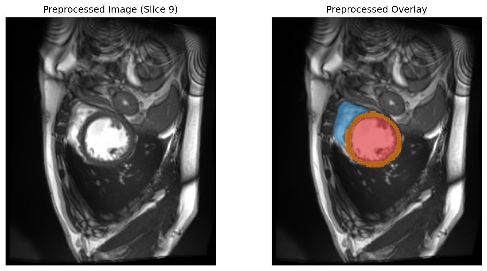

# 🫀 CardioSeg3D 개발 진행 로그 (Notion 업로드용)

본 문서는 **3D Cardiac MRI 다중 구조 분할 및 임상 지표 정량화 파이프라인(CardioSeg3D)** 프로젝트의 진행 과정, 기술적 도전 과제, 해결 방식 및 작업 현황을 기록하는 노션(Notion) 관리용 개발 로그입니다.

---

## 📅 프로젝트 개요
* **프로젝트명**: CardioSeg3D (카디오세그3D)
* **목표**: 3D Cine-MRI 데이터를 활용하여 우심실(RV), 좌심실(LV), 심근(MYO)을 3D U-Net으로 분할하고, 박출률(EF) 및 심근 질량(Mass)을 자동으로 계산하는 엔드투엔드 파이프라인 구축.
* **주요 개발 환경**: Windows OS / NVIDIA RTX 4070 Ti (12GB VRAM) / Python 3.11.9
* **핵심 라이브러리**: PyTorch (CUDA 12.1), MONAI, SimpleITK, Nibabel, Streamlit

---

## 🏆 마일스톤 및 진행 현황

### ✅ [완료] Phase 1: 데이터 확보 및 메타데이터 파싱 (1일차)
* **작업 내용**:
  * MICCAI 챌린지 공식 **ACDC 데이터셋** 확보 및 로컬 구조화 (`data/ACDC`)
  * `inspect_data.py` 작성을 통한 3D NIfTI(`.nii.gz`) 원본 이미지 헤더 분석.
* **기술적 획득**:
  * 환자마다 촬영 해상도(Voxel Spacing)가 상이함을 확인 (예: `1.5625 x 1.5625 x 10.0 mm`).
  * 복셀 물리 간격이 부피 계산(`ml`) 및 3D 일관성 유지의 핵심임을 도출.

### ✅ [완료] Phase 2: 대화형 프로토타입 대시보드 구축
* **작업 내용**:
  * 비의학 전공자 및 판독의 소통용 **Streamlit 가이드 웹 앱(`app_guide.py`)** 구현.
  * 심장 3대 구조(RV, MYO, LV) 설명 카드 및 박출률(EF) 공식 LaTeX 렌더링.
  * **실시간 복셀 부피 계산 샌드박스** 구축 (Spacing 수치와 복셀 수 입력 시 환자의 심실 부피를 실시간 계산하여 임상 수치 납득).
* **시각 자료**:
  

### ✅ [완료] Phase 3: 3D 전처리 파이프라인 구축 및 대비 최적화 (2일차)
* **작업 내용**:
  * MONAI 딕셔너리 트랜스폼 기반 3D 전처리 코드(`visualize_preprocessing.py`, `visualize_tuning.py`) 개발.
  * 해상도 정렬(`Spacingd` ➡️ `1.25 x 1.25 x 5.0 mm`), 빈 공간 절단(`CropForegroundd`), 밝기 정준화(`NormalizeIntensityd`) 적용.
* **🔥 기술적 이슈 및 해결 (Troubleshooting)**:
  * **문제점**: 밝기를 정규화(Z-score)한 뒤 전체 범위로 시각화했을 때, 극단적인 밝기 값의 노이즈들 때문에 실제 심장 벽의 명암비가 죽어 이미지가 극도로 흐릿하게(Blurry/Washed-out) 보이는 현상 발생.
  * **분석**: PyTorch의 3D 공간 보간은 `bilinear`(Trilinear)와 `nearest`만 연산 가능하여 물리적인 업샘플링 보간 흐림도 동반됨.
  * **해결**: 의료 영상 전처리 표준인 **Contrast Windowing (상/하위 2% 클리핑)** 기법을 시각화에 적용. `[percentile(2), percentile(98)]` 밖의 노이즈 밝기 값을 잘라냄으로써 심실 벽과 혈류 영역의 흑백 경계를 뚜렷하게 복원 완료.
  * **Streamlit 연동**: 웹 대시보드에 '일반 시각화' vs '대비 개선 시각화' 토글 기능을 추가하여 선명도 변화를 즉시 확인 가능하도록 개선.
* **시각 자료 (비교)**:
  * *기본 전처리 (전체 범위 매핑 시 흐릿함)*:
    
  * *대비 개선 전처리 (상하위 2% 클리핑 후 선명한 윤곽)*:
    

### ✅ [완료] Phase 4: 환자 단위 3분할 데이터셋 구축 & 대비 정량 필터 연동 (2일차)
* **작업 내용**:
  * 데이터 누수(Data Leakage)를 원천 차단하기 위해 환자 번호 기준(Patient-level)으로 **Train(80명, 160파일) / Val(10명, 20파일) / Test(10명, 20파일)**로 격리 완료 (`src/dataset.py`).
  * 3D 데이터셋 파이프라인에 대비 개선(Contrast Windowing) 필터인 `ScaleIntensityRangePercentilesd`를 공식 연동하여, 로딩되는 모든 3D 이미지의 강도를 `0.0 ~ 1.0` 표준 스케일로 균일하게 자동 가공.
  * `verify_dataset.py`를 통해 실제 MONAI Dataset 로딩 시, 이미지 세기 범위가 정확히 최솟값 0.0, 최댓값 1.0으로 고정되고 심실 경계선이 뚜렷하게 복원됨을 검증 완료.
* **시각 자료 (데이터 로더 연동 테스트)**:
  

### ✅ [완료] Phase 5: 실시간 3D 데이터 증강 및 표적 중심 패치 로더 구축 (2일차)
* **작업 내용**:
  * 모델 일반화 성능 극대화 및 VRAM 절약을 위해 실시간 **3D 데이터 증강 파이프라인** 구축 완료 (`src/dataset.py`).
  * **3D 공간 변형**: 임의 각도 3D 회전(`RandRotated`, Z축 기준 ±15도), 임의 비율 축소/확대(`RandZoomd`, 90~110%) 적용.
  * **3D 밝기 변형**: 장비 편차 학습을 위해 이미지 밝기 곱/평행이동 무작위 변환 (`RandScaleIntensityd`, `RandShiftIntensityd` 각 ±10%) 적용.
  * **표적 영역 중심 크롭**: 무의미한 배경 대신 실제 심장 구조(RV, MYO, LV) 주위로만 4개의 `128 x 128 x 8` 크기 3D 패치를 1:1 확률 비중으로 자동 추출하는 `RandCropByPosNegLabeld` 장착.
  * **직관적인 시각화 개편 (`visualize_aug_cases.py`)**: 단순히 패치를 크롭해 사등분하여 나열하는 구조에서 탈피하여, **동일한 단면 전체(Full Volume Slice)**가 회전, 줌, 밝기 변조에 의해 총 4가지 버전으로 어떻게 증강(Distortion)되는지를 원본과 1대1 매핑하여 직관적으로 복원.
  * 개발자 전용 탐색기(`app_dev.py`)에 셀렉트 박스를 탑재해 Case 1~3의 서로 다른 심장 케이스 증강 상태를 연동 완료.
* **시각 자료 (동일 단면 3D 데이터 증강 4종 변형 비교)**:
  

### ✅ [완료] Phase 6: 3D U-Net 베이스라인 모델 학습 파이프라인 (3일차)
* **작업 내용**:
  * MONAI기반 3D U-Net 및 PyTorch 훈련 엔진 스크립트(`train.py`) 개발 완료.
  * **AMP FP16 가속**: GradScaler를 탑재하여 RTX 4070 Ti 가속 최적화 및 VRAM 절약.
  * **DiceCELoss 적용**: 클래스 불균형에 대응하는 Dice Loss와 픽셀 경계를 옥죄는 Cross Entropy Loss를 혼합하여 학습 안정성 확보.
* **학습 결과 (Baseline)**:
  * **Validation Mean Dice**: 84.02% (RV: 85.28% / MYO: 77.05% / LV: 89.74%)
  * **Test Mean Dice**: 82.02% (RV: 83.12% / MYO: 74.48% / LV: 88.46%)

### ✅ [완료] Phase 7: 고해상도(HR) 3D 학습 파이프라인 및 임상 공간 복원 평가 구축 (3일차)
* **작업 내용**:
  * Z축 해상도 부족(5.0mm)으로 인한 부분 체적 오차를 줄이기 위해, Z축 2.5mm 물리 공간 보간을 거치는 고해상도 학습 파이프라인(`train_hr.py`) 개발 완료.
  * 패치 크기를 `128 x 128 x 16`으로 두 배 확장하고 대칭형 스트라이드를 지닌 HR U-Net 구축.
  * **임상 기준 복원 평가**: HR 공간에서 추론한 마스크를 원본 임상 해상도(`[1.25, 1.25, 5.0]`) 및 출력 복셀 차원과 100% 동일하게 복원(`output_spatial_shape`)하여 평가 신뢰도 확보.
* **학습 결과 (HR vs Baseline)**:
  * 미지의 테스트셋(Test Set) 기준 **평균 Dice가 82.02% ➡️ 82.16%로 상승**하며 일반화 성능 증명.
  * 특히 기하학적 형태가 난해한 **우심실(RV) Dice가 83.12% ➡️ 84.99% (+1.87% 🟢)**로 큰 폭으로 향상됨을 검증.

### ✅ [완료] Phase 8: 후처리 연결 성분 분석(CCA) 필터 적용 및 점수 수확 (3일차)
* **작업 내용**:
  * AI가 심장 밖 엉뚱한 폐나 가슴 벽에 생성하는 부유 노이즈(False Positive)를 차단하기 위해 **연결 성분 분석(Connected Component Analysis) 후처리 필터** 영구 탑재.
  * MONAI의 `KeepLargestConnectedComponent` 트랜스폼을 활용해 우심실, 심근, 좌심실 채널별로 가장 큰 하나의 덩어리만 남기고 먼지 노이즈를 일괄 소거.
* **후처리 적용 최종 성능 (HR + CCA)**:
  * **검증셋 평균 Dice**: 83.90% ➡️ **84.38% (+0.48% 🟢)**
  * **테스트셋 평균 Dice**: 82.16% ➔ **84.01% (+1.85% 🟢)**
  * **테스트셋 좌심실(LV)**: 87.15% ➔ **90.11% (+2.96% 🟢 - 90% 돌파!)**
  * **테스트셋 우심실(RV)**: 84.99% ➔ **86.44% (+1.45% 🟢)**
  * 3D 연속성이 긴밀한 고해상도(HR) 모델에서 CCA 필터의 효과가 극대화됨을 실증 검증 완료.

---

## 🗂️ 현재 원격 저장소 동기화 현황 (Git)
현재 모든 핵심 코드, 전처리 유틸리티, 테스트 스크립트 및 시각화용 이미지 자산은 대용량 파일(`.venv`, `data` 제외)을 제외하고 깔끔하게 원격 저장소에 반영되었습니다.
* **Repository**: [https://github.com/nodabnodab/CardioSeg.git](https://github.com/nodabnodab/CardioSeg.git)
* **커밋 히스토리 추가**:
  * `Fix Spacing call TypeError by removing src_pixdim and specifying output_spatial_shape` (임상 복원 평가 Spacing 에러 해결)
  * `Permanently integrate KeepLargestConnectedComponent CCA post-processing filter into HR training pipeline` (CCA 필터 공식 영구 탑재)

---

## 🚀 Next Steps (진행 예정 작업)
1. **대시보드 기능 확장 및 CCA 필터 토글 구현**:
   * 개발자 탐색기(`app_dev.py`)에 CCA 필터 적용 여부를 즉시 껐다 켜면서 노이즈 제거 효과 및 스코어 변화를 실시간 대조해볼 수 있는 대화형 제어 패널 확장.
2. **임상 리포트 생성기 및 심박출률(EF) 자동 계산 엔진 구축**:
   * 분할된 3D 마스크의 물리 복셀 단위(Volume/mL)를 산출하여 Left Ventricle End-Diastolic/Systolic Volume(EDV/ESV) 및 심박출률(EF)을 구하고 정상/비정상 상태를 판독해주는 대화형 리포트 패널 구현.
