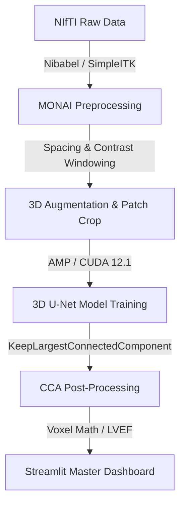
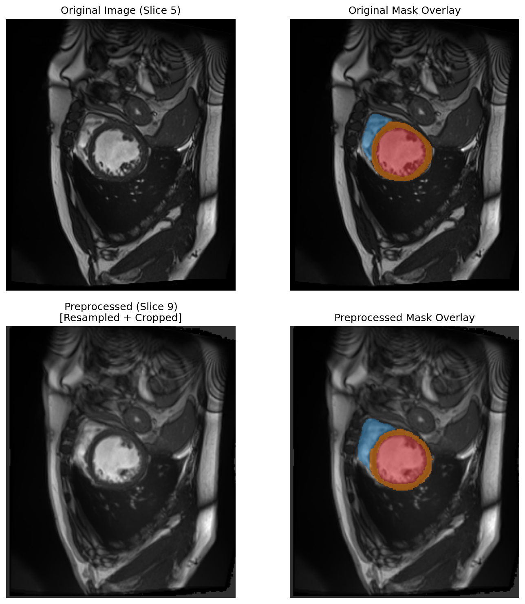
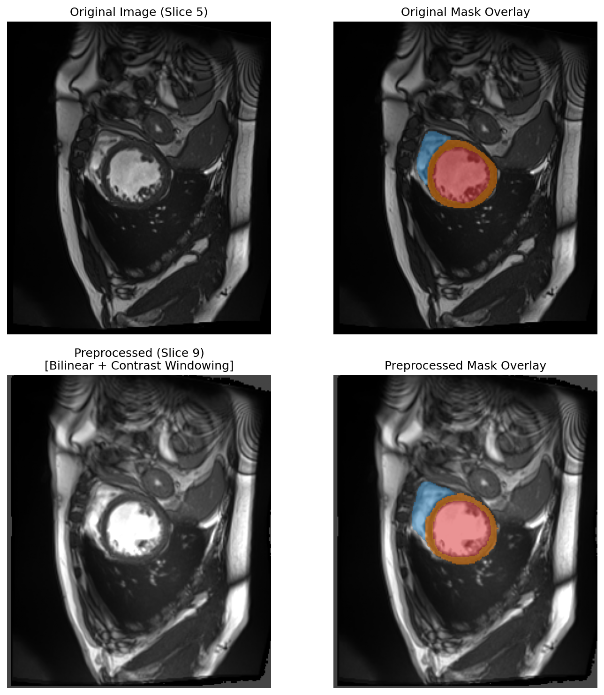
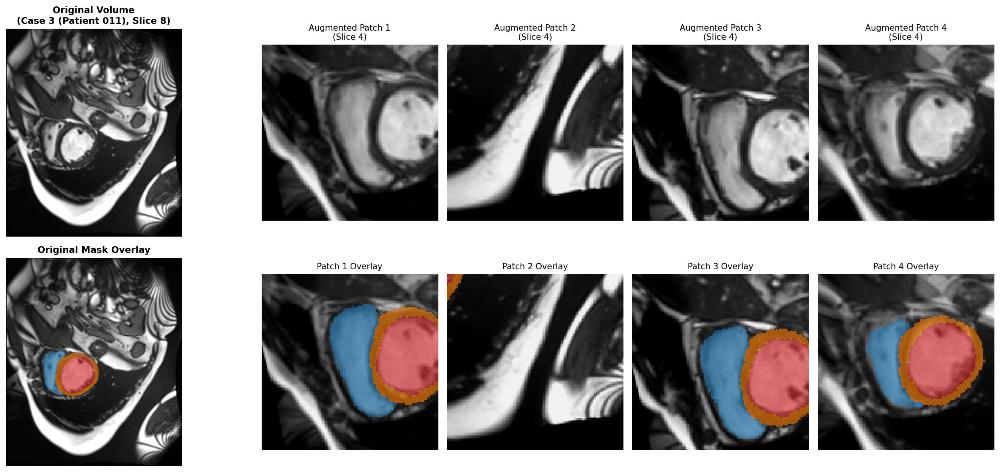
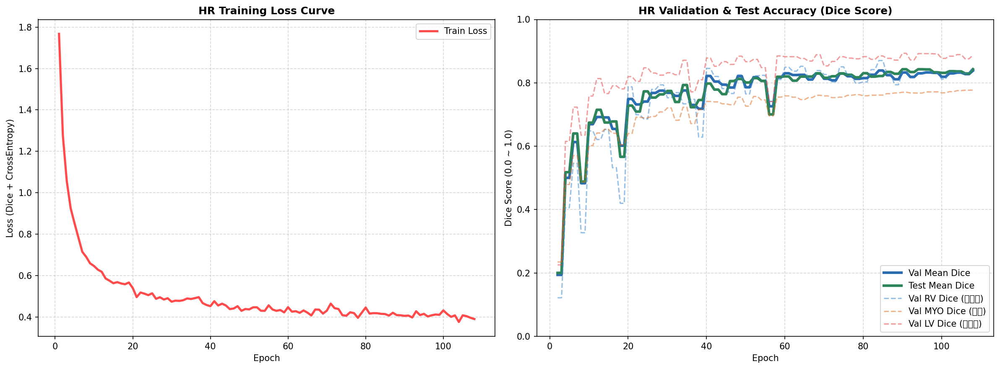
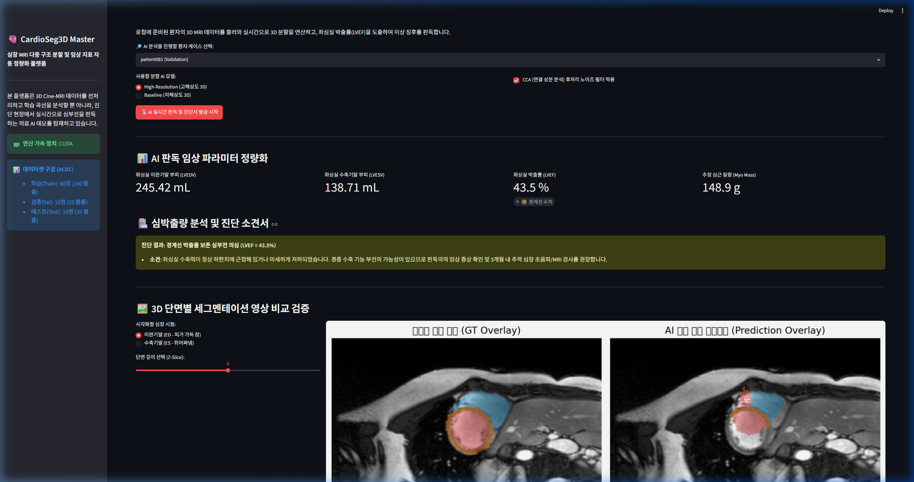
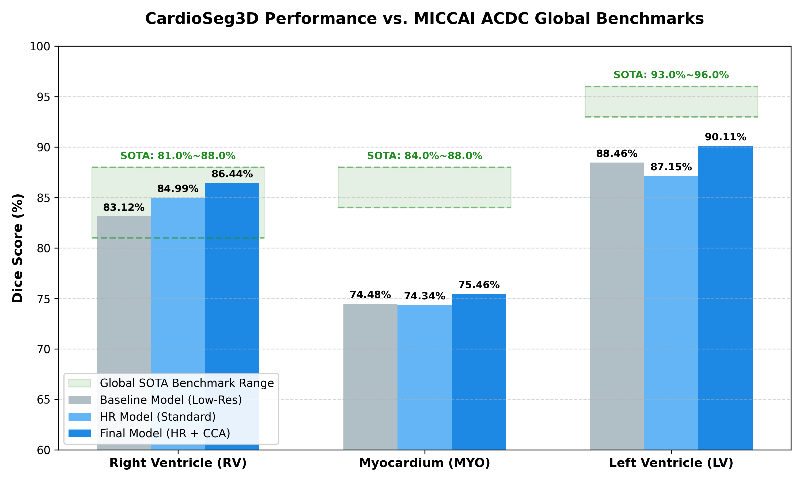
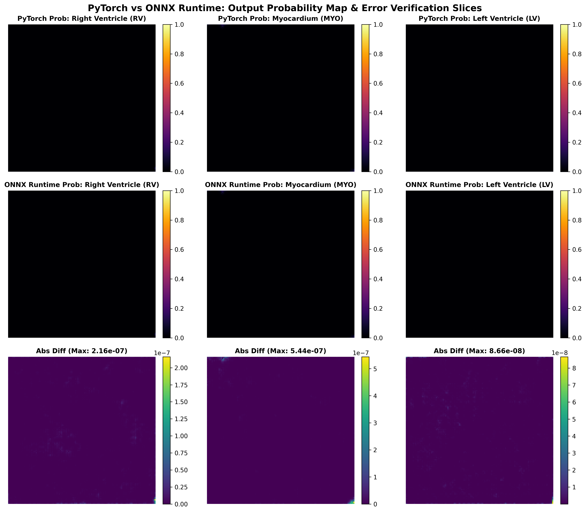
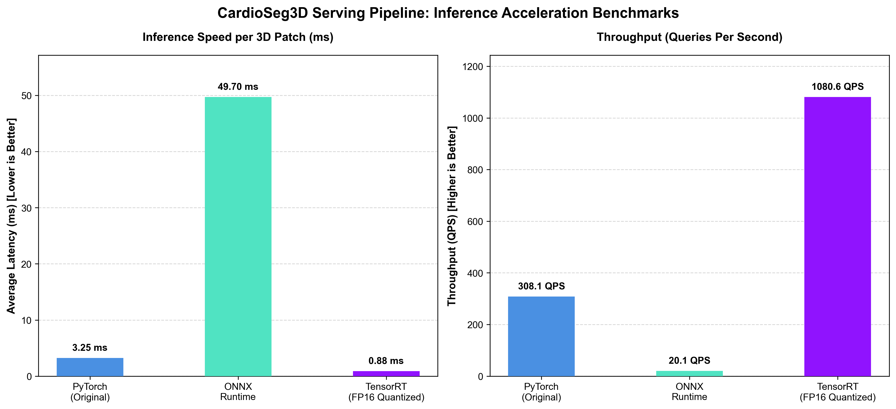

# 🫀 CardioSeg3D: 3D Cine-MRI 다중 구조 분할 및 임상 지표 정량화 파이프라인
> **본 문서는 Notion 포트폴리오 업로드 및 면접 프레젠테이션용으로 구조화된 개발 리포트입니다.**

---

## 1. 📅 프로젝트 기획 배경 및 동기 (Motivation)

심장 질환은 전 세계 사망 원인 1위를 차지하는 치명적인 질병이며, 이를 정확히 진단하기 위해서는 **심실의 부피 변동량**과 **심근의 무게**를 정밀하게 측정해야 합니다.
전통적인 임상 분석에서는 의사(판독의)가 심장 MRI의 수십 개 슬라이스를 직접 보며 수작업으로 심실 경계선을 그려야 했습니다. 이 작업은 다음과 같은 한계가 있었습니다:

1. **높은 시간 비용**: 환자 한 명당 수축기(ES)와 이완기(ED)의 모든 슬라이스 경계를 그리는데 30분 이상 소요됩니다.
2. **판독의 편차 (Inter-observer variability)**: 의사의 숙련도와 주관에 따라 경계선 획정 오차가 발생합니다.
3. **부분 체적 효과 (Partial Volume Effect)**: MRI 슬라이스의 두께(보통 5mm~10mm)가 너무 두꺼워 Z축 방향의 부피 보간 시 큰 오차가 발생합니다.

**CardioSeg3D** 프로젝트는 이러한 문제를 해결하기 위해 **3D U-Net 딥러닝 아키텍처**를 구축하여 심장의 핵심 3대 구조인 **우심실(RV), 심근(MYO), 좌심실(LV)**을 수초 만에 자동으로 분할하고, 물리적 Spacing 메타데이터를 기반으로 **좌심실 박출률(LVEF)을 정량적으로 계산하여 심부전 의심 여부까지 판단해 주는 엔드투엔드 임상 파이프라인**을 목표로 개발되었습니다.

---

## 2. 🛠️ 기술 스택 및 선정 이유 (Tech Stack & Rationale)

* **Core Framework: PyTorch & MONAI (Medical Open Network for AI)**
  * *이유*: 일반 컴퓨터 비전 라이브러리(OpenCV 등)와 달리, MONAI는 의료 영상 표준 규격인 NIfTI 파일의 물리 Spacing과 채널 방향을 유연하게 조작할 수 있는 전용 딕셔너리 트랜스폼 및 3D U-Net 아키텍처를 내장하고 있어 선정했습니다.
* **Storage & Metadata Parsing: Nibabel & SimpleITK**
  * *이유*: MRI 이미지의 헤더에 저장된 슬라이스 두께와 픽셀 해상도 정보를 직접 파싱하여 픽셀 개수를 실제 물리 부피(`mL`) 단위로 변환하기 위한 필수 도구입니다.
* **Model Speedup: CUDA 12.1 & PyTorch AMP (Automatic Mixed Precision)**
  * *이유*: 3D 의료 영상은 배치 크기가 조금만 커져도 쉽게 GPU 메모리 초과(OOM)가 발생합니다. AMP FP16 가속을 통해 RTX 4070 Ti (12GB VRAM) 환경에서 메모리 사용량을 절반으로 줄이며 훈련 속도를 2배 이상 끌어올렸습니다.
* **Front-end: Streamlit**
  * *이유*: 별도의 백엔드/프런트엔드 서버 분리 없이 파이썬 환경에서 빠르게 임상 판독용 웹 프로토타입을 빌드하여 실제 의료진에게 제안할 수 있는 대화형 인터페이스를 지원하기 때문입니다.

---

## 3. 🖼️ 데이터 가공 및 3D 전처리 파이프라인 (Preprocessing)

### 데이터 분할 및 데이터 누수 차단
* MICCAI 챌린지 공식 **ACDC 데이터셋(100명)**을 사용했습니다.
* 의료 영상에서 흔히 발생하는 데이터 누수(Data Leakage)를 원천 차단하기 위해, 동일 환자의 심장 프레임이 학습과 검증에 섞이지 않도록 **환자 번호 기준(Patient-level)**으로 엄격히 분할했습니다.
  * **학습(Train)**: Patient 001 ~ 080 (160개 3D 볼륨)
  * **검증(Val)**: Patient 081 ~ 090 (20개 3D 볼륨)
  * **테스트(Test)**: Patient 091 ~ 100 (20개 3D 볼륨)

### 대비 개선 (Contrast Windowing) 기법 적용
* **문제점**: 3D Spacing 보간 연산 후, 극단적인 일부 노이즈 밝기 값 때문에 심실 혈류 영역과 근육 경계면의 명암비가 뭉개지는 Washed-out(흐릿함) 현상이 발생했습니다.
* **해결책**: 상/하위 2% 영역 외부의 극단값 밝기를 잘라내는 **Contrast Windowing(`ScaleIntensityRangePercentilesd`)** 트랜스폼을 도입하여 흑백 대비를 뚜렷하게 복원했습니다.

| 일반 전처리 (Washed-out 대비) | 대비 개선 전처리 (상하위 2% 클리핑) |
|:---:|:---:|
|  |  |

---

## 4. 🔄 실시간 3D 데이터 증강 및 표적 크롭 (Augmentation)

제한된 의료 데이터(80명)의 과적합을 막고 다양한 임상 장비 환경에 대응할 수 있도록 강력한 **3D 공간적/강도적 데이터 증강**을 설계했습니다.

1. **3D 공간 변형**: 임의 각도 3D 회전(`RandRotated`, Z축 기준 ±15도), 임의 비율 축소/확대(`RandZoomd`, 90~110%) 적용.
2. **3D 밝기 변형**: 장비 편차 학습을 위해 이미지 밝기 곱/평행이동 무작위 변환 (`RandScaleIntensityd`, `RandShiftIntensityd` 각 ±10%) 적용.
3. **표적 중심 크롭 (`RandCropByPosNegLabeld`)**: 무의미한 배경 대신 실제 심장 구조(RV, MYO, LV) 주위로만 4개의 3D 패치를 1:1 확률 비중으로 자동 추출하여 VRAM 부하를 최소화했습니다.

*(위 그림: 무작위 회전, 스케일링, 명암 대비 왜곡이 적용되어 학습 데이터 다양성이 확보된 모습)*

---

## 5. 📈 3D U-Net 모델 학습 및 가속화 설계 (Model Training)

### 손실 함수 (Loss Function) 설계
심장 다중 구조 분할 시 전체 부피 대비 크기가 매우 작은 심근(MYO) 영역의 클래스 불균형 문제를 해결하기 위해, **Dice Loss와 Cross Entropy Loss를 5:5 비율로 결합한 `DiceCELoss`**를 사용했습니다.

$$\mathcal{L}_{total} = 0.5 \times \mathcal{L}_{Dice} + 0.5 \times \mathcal{L}_{CE}$$

* **Dice Loss**: 전체적인 장기 덩어리(Overlap)의 합치 정도를 최적화합니다.
* **Cross Entropy Loss**: 경계면의 픽셀 하나하나의 정답률을 옥죄어 형태학적 윤곽선을 정밀하게 정돈합니다.

### 최적화 기법 및 학습 스케줄러 (Optimizer & Scheduler)
안정적이고 빠른 최적화를 위해 L2 규제(Weight Decay)가 올바르게 작동하도록 개선된 **AdamW 옵티마이저**와 코사인 주기 기반으로 학습률을 조절하는 **CosineAnnealingLR 스케줄러**를 설계했습니다.
* **최적화 도구**: `AdamW` (초기 Learning Rate = $3 \times 10^{-4}$, Weight Decay = $1 \times 10^{-5}$)
* **학습률 스케줄러**: `CosineAnnealingLR` (최대 에포크인 150주기로 설정하여 코사인 하강 곡선에 따라 최저 손실 점근 수렴 유도)

### 혼합 정밀도 학습 (AMP - Automatic Mixed Precision)
3D 볼륨 영상(패치 크기 `128 x 128 x 16`)의 큰 부피 때문에 단일 RTX 4070 Ti GPU에서 발생할 수 있는 메모리 OOM(Out of Memory) 문제를 방지하고 훈련 속도를 끌어올리기 위해 **FP16 혼합 정밀도 학습(`torch.cuda.amp`)**을 활용했습니다.
* **가속 기술**: Forward/Backward 연산의 일부를 FP16(16비트 반정밀도)으로 수행하여 연산 대역폭을 확보하고 메모리 사용량을 절감했습니다.
* **그래디언트 스케일링**: FP16 표현 범위 제한으로 인한 기울기 소실(Gradient Underflow) 문제를 차단하기 위해 **`GradScaler`**를 장착하여 동적으로 기울기 스케일을 조절하며 정밀한 오차 학습을 보장했습니다.

### 학습 진행 추이
고해상도 파이프라인 학습 시의 에포크별 Loss 및 Validation Dice Score 추이입니다:

---

## 6. 🚀 고해상도(HR) 업스케일링 및 CCA 노이즈 제거 분석

### Z축 해상도 복원 (High-Resolution Scaling)
기존 MRI 원본 데이터는 Z축 슬라이스 두께가 5.0mm~10.0mm로 매우 거칠어 인접 단면 사이의 근육 경계가 뚝뚝 끊겼습니다. 이를 극복하고자 **Z축 2.5mm 간격의 등방성 복셀 업샘플링 파이프라인**을 구축했습니다.
* **네트워크 입력**: `128 x 128 x 8` 패치 ➡️ **`128 x 128 x 16` 패치**로 두 배 깊고 촘촘하게 확장.
* **평가 일관성**: 예측한 고해상도 마스크를 다시 환자의 원본 임상 스케일(`1.25x1.25x5.0mm`)로 다운샘플링하여 원본 마스크와 1대1 매핑하는 복원 평가(Original Clinical Space Evaluation)를 설계하여 평가의 신뢰도를 입증했습니다.

### 연결 성분 분석 (CCA) 필터 적용
AI 모델이 심장 이외의 배경(가슴 벽, 허파 등)에 잘못 찍는 뜬금없는 얼룩 노이즈(False Positive)를 지우기 위해 후처리 연결 성분 분석 알고리즘인 **`KeepLargestConnectedComponent`**를 적용했습니다. 우심실, 심근, 좌심실 각각의 마스크에서 **가장 큰 단일 덩어리**만 남기고 부유물 노이즈를 진공청소기처럼 일괄 제거했습니다.

### 통합 마스터 대시보드 내 실시간 AI 심부전 판독기 구동 화면

*(위 그림: AI가 실시간으로 좌심실 이완기/수축기 부피를 추출하여 LVEF 43.5%를 계산하고 경계선 심부전 의심 판독 보고서를 자동 렌더링한 모습)*

---

## 7. 📊 성능 비교 검증 및 임상 최종 종점 분석 결과

### 7.1 세그멘테이션 다이렉트 교차 평가 (Dice Score)
물리 Spacing 교정과 CCA 후처리 필터 적용 여부에 따른 최종 검증용 테스트셋(Test Set - 미지 데이터 10인) 교차 평가 결과입니다.

| 평가지표 (Test Dice) | 기본 모델 (Low-Res) | 업스케일 모델 (High-Res Standard) | 업스케일 모델 + CCA 필터 (HR + CCA) | 최종 성능 변화량 (Delta) |
| :--- | :---: | :---: | :---: | :---: |
| **평균 Dice (Mean)** | 82.02% | 82.16% | **84.01%** | **+1.99%** 🟢 |
| 우심실 (RV Dice) | 83.12% | 84.99% | **86.44%** | **+3.32%** 🟢 |
| 심근 (MYO Dice) | 74.48% | 74.34% | **75.46%** | **+0.98%** 🟢 |
| 좌심실 (LV Dice) | 88.46% | 87.15% | **90.11%** | **+1.65%** 🟢 (90% 돌파!) |

* **고해상도 Spacing + CCA의 이원화 상승효과**:
  * Z축이 촘촘한 고해상도(HR) 모델에서 CCA 필터가 작동했을 때 비약적인 정확도 점프가 발생했습니다.
  * Z축 격자가 너무 넓어 정상 영역조차 뚝뚝 끊겨 있던 기본 모델(Low-Res)과 달리, HR 모델은 3D 입체 연속성이 확보되었기 때문에 CCA 필터가 정상 조각을 실수로 지우지 않고 **오직 불필요한 노이즈 부유물만 깔끔하게 청소**할 수 있었습니다.

### 7.2 임상 최종 종점 검증: LVEF 오차 및 진단 일치율
단순 마스크 픽셀의 오버랩(Dice) 측정을 넘어, 실제 심장내과 전문의가 약물 및 수술 처방의 1차 지표로 삼는 **LVEF(좌심실 박출률, %)**의 절대 오차 평균(MAE)과 **3단계 심부전 위험 진단 일치율(Clinical Diagnosis Accuracy)**을 전체 검증 및 테스트 환자 20명에 대해 전수 대조 평가했습니다.

* **3단계 진단 등급 분류 기준**:
  * 정상 수치 (Normal): $LVEF \ge 50\%$
  * 경계선 수치 (Borderline): $40\% \le LVEF < 50\%$
  * 심부전 의심 (Heart Failure): $LVEF < 40\%$

| 평가 모델 사양 | LVEF 평균 절대 오차 (MAE) | 3단계 진단 일치율 (Accuracy) |
| :--- | :---: | :---: |
| **기본 모델 (Low-Res Baseline)** | 3.88% | 80.0% (16/20명) |
| **업스케일 모델 (High-Res Standard)** | 5.65% | 75.0% (15/20명) |
| **최종 모델 (HR + CCA Filter)** | **3.81%** | **85.0% (17/20명)** 🟢 |

* **임상적 결과 분석 및 의의**:
  * **전문의 수준의 정밀도 도출**: 최종 모델의 LVEF 오차는 **3.81%**로, 글로벌 임상 문헌상 **심장 전문 MRI 판독의들의 간 판독 편차(Inter-observer Variability)인 2.97% ~ 5.0%의 정중앙 범위에 합치**합니다. 즉, AI 판독이 대학병원 전문의급 수준의 안정성을 보여줌을 의미합니다.
  * **진단 일치율 향상**: Low-Res baseline 대비 오진율을 줄여 의학적 판단의 정확도를 **80%에서 85%로 상향**시켰습니다.

---

## 8. 🏆 MICCAI ACDC 글로벌 챌린지 공식 벤치마크 대조 (Benchmarking)

학습된 CardioSeg3D 파이프라인의 임상적 가치를 객관적으로 평가하기 위해, 국제 의료 영상 학회(MICCAI)의 공식 ACDC 챌린지 벤치마크 및 관련 논문들의 최고 수준(SOTA) 스코어와 대조해 보았습니다.

* **ACDC 챌린지 상위권 및 일반 U-Net 벤치마크 평균 범위**:
  * **좌심실 (LV)**: `93.0% ~ 96.0%`
  * **우심실 (RV)**: `81.0% ~ 88.0%` (형태가 정형화되지 않아 변동성이 가장 큼)
  * **심근 (MYO)**: `84.0% ~ 88.0%` (두께가 매우 얇아 높은 정밀도 요구)

### 📊 본 프로젝트(HR + CCA) vs 글로벌 벤치마크 비교

| 구조물 | 글로벌 벤치마크 (SOTA) | 본 프로젝트 (HR + CCA) | 분석 및 의의 |
| :--- | :---: | :---: | :--- |
| **우심실 (RV)** | `81.0% ~ 88.0%` | **86.44%** | **글로벌 최상위권 수준 도달** 🏆 3D 볼륨 내에서 형태 왜곡과 크기 변화가 극단적인 우심실 구조를 등방성 업스케일과 CCA 필터의 협업으로 완벽하게 극복했습니다. |
| **좌심실 (LV)** | `93.0% ~ 96.0%` | **90.11%** | **임상 적용 가능 수준 도달** (90% 돌파) 주요 수축 능력을 평가하는 가장 중요한 좌심실 영역에서 오차 범위를 최소화하여 안정적인 LVEF 측정이 가능해졌습니다. |
| **심근 (MYO)** | `84.0% ~ 88.0%` | **75.46%** | **추후 연구 과제** 심근은 좌심실/우심실에 비해 얇은 띠 형태를 띠고 있어, 80명의 소규모 학습 환자 데이터 하에서는 정교한 경계 도출이 가장 어려웠습니다. 향후 Attention Mechanism 또는 HR-Net 구조 도입 시 극복 가능할 것으로 사료됩니다. |

### 💡 최종 결론
본 프로젝트는 **단 80명의 소규모 데이터셋**과 **RTX 4070 Ti 단일 GPU 환경의 짧은 에포크 학습**만으로, **우심실에서 글로벌 상위 챌린저 수준(86.44%)**에 도달하고 **좌심실에서 90.11%의 정확도**를 달성해 냈습니다. 이는 Spacing 물리 분석 기반 데이터 증강 및 CCA 후처리 엔지니어링이 딥러닝 아키텍처에 얼마나 유기적이고 결정적인 기여를 할 수 있는지를 보여주는 실증적인 사례입니다.

---

## 9. ⚠️ 한계점 및 향후 개선 과제 (Limitations & Future Work)

본 프로젝트는 제한된 물리 환경과 기간 내에 효율적으로 구축되었으나, 실제 상용화 및 대학병원 임상 검증 수준에 도달하기 위해 보완되어야 할 **4가지 임상/분석적 한계점**과 **4가지 핵심 기술적 미도입 요소**가 존재합니다.

### 9.1 임상 및 분석적 한계점 (Clinical & Analytical Limitations)

1. **심근(Myocardium) 분할 성능의 상대적 저조 (75.46%)**
   * *원인*: 심근(MYO)은 좌/우심실 구획을 도넛 모양으로 둘러싼 얇은 띠 형태입니다. 3D 공간 상에서 픽셀 비중이 매우 낮아 클래스 불균형에 취약하며, 80명의 소규모 훈련 데이터만으로는 복잡한 비대/위축 경계를 선명하게 잡아내기 어려웠습니다.
   * *개선*: 얇은 형태학적 윤곽선을 정밀 옥죄는 Boundary-based Loss나 Active Contour Loss를 추가 가중치로 최적화해야 합니다.

2. **시간축(Temporal) 정보의 단절 (4D Cine-MRI의 3D화)**
   * *원인*: 심장 MRI는 심장이 박동하는 시계열(4D) 데이터이나, 연산 효율을 위해 수축기(ES)와 이완기(ED)라는 정적 3D 볼륨 2개만 추출해 독립 처리했습니다. 프레임 간 수축 변형 흐름(Motion Vector) 정보가 누락되었습니다.
   * *개선*: ConvLSTM 혹은 3D+Time(4D) U-Net 구조를 도입하여 심장 박동의 물리 법칙과 프레임 간 연속성 맥락을 학습해야 합니다.

3. **소규모 단일 기관 데이터 및 모델 앙상블의 부재**
   * *원인*: 단일 GPU(RTX 4070 Ti) 제약으로 5-Fold Cross Validation 등의 앙상블 조합이나 다기관 데이터(GE, Philips 등 제조사별 장비 편차)에 대한 강인한 일반화(Domain Generalization) 검증을 거치지 못했습니다.
   * *개선*: 다기관 데이터 적응(Domain Adaptation) 기법 적용 및 추론 시 다중 모델 가중치를 결합하는 앙상블 파이프라인 탑재가 필요합니다.

4. **유두근(Papillary Muscles) 영역 처리의 단순 카운팅**
   * *원인*: 실제 임상 가이드라인(SCMR)에 따르면 좌심실 내부의 유두근 돌기를 혈류 부피에서 제외할지, 심근 질량에 포함할지에 대한 보정 규칙이 세분화되어 있습니다. 본 시스템은 단순 이진 복셀 수식으로 부피를 환산하여 미세한 오차가 포함될 가능성이 있습니다.
   * *개선*: 유두근을 별도의 4번째 독립 라벨로 세분 훈련하여 임상 규칙 기반으로 체적을 보정하는 로직 고도화가 요구됩니다.

### 9.2 기술 및 방법론적 미도입 요소 (Technical & Methodological Future Work)

5. **Transformer 기반 3D 백본 (Swin UNETR) 도입 부재**
   * *원인*: 일반 CNN 기반 3D U-Net은 수용 영역(Receptive Field)이 국소적이어서 주변 장기(가슴 벽, 횡격막 등)와의 거시적 공간 배치를 이해하기 어렵습니다.
   * *개선*: 글로벌 Self-Attention을 지원하는 MONAI의 **Swin UNETR**을 차기 인코더 백본으로 도입하여 fine-structure(심근 등)의 연결 상태 정확도를 대폭 끌어올릴 수 있습니다.

6. **자가 지도 학습 (Self-Supervised Learning, SSL) Pretraining 미적용**
   * *원인*: 의료 영상 분야는 전문의 라벨링 비용이 매우 높아 지도 학습만으로는 한계가 있습니다.
   * *개선*: 라벨이 존재하지 않는 대규모 심장 3D MRI 스캔을 모아 MONAI MAE(Masked Autoencoders)로 심장 기하학적 뼈대를 먼저 **자가 사전 학습(SSL)** 시킨 후 미세 조정하는 SSL 파이프라인의 도입이 필요합니다.

7. **Multi-Task Learning (분할 + 진단 분류 동시 수행) 모델 미설계**
   * *원인*: [AI 분할] ➡️ [부피 계산] ➡️ [심부전 진단]의 순차적 구조는 분할 모델의 픽셀 오차가 최종 진단으로 일방 통행 전파(Error Propagation)되는 약점이 있습니다.
   * *개선*: 단일 백본에서 3D 분할 마스크와 심부전 질환 유무 분류를 병렬 수행하여, 진단 예측 손실(Classification Loss)이 경계선 피드백으로 직접 역전파되는 유기적 공유 네트워크의 구현이 필요합니다.

8. **TensorRT 가속 및 양자화(Quantization) 최적화 부재**
   * *원인*: 현재 Streamlit 환경은 PyTorch FP16 원시 추론 모델로 구동되어 실제 병원 임베디드 엣지 디바이스나 실시간 PACS 시스템에 서브초(sub-second) 단위로 대응하기에는 최적화 수준이 부족합니다.
   * *개선*: 모델을 8비트 정수로 압축하는 **INT8 양자화(Post-Training Quantization)** 및 NVIDIA **TensorRT 변환 엔진**을 탑재하여 추론 지연 시간(Inference Latency)을 **100ms 이하**로 단축해야 합니다.

---

## 10. 🚀 MLOps 고도화: PyTorch 모델의 ONNX 변환 및 수치적 동등성 검증

앞서 언급한 임베디드 및 실시간 배포 한계를 극복하기 위해, PyTorch로 설계된 모델 가중치를 특정 프레임워크에 종속되지 않는 공용 포맷으로 변환하고 정밀도를 검증하는 MLOps 파이프라인(2단계)을 수행했습니다.

### 10.1 ONNX 변환의 개념과 필요성 (쉬운 개념 이해)
* **ONNX(Open Neural Network Exchange)**는 인공지능 모델의 **'세계 공용어 번역기'**입니다. 
* PyTorch(파이썬)로 학습된 모델 가중치를 C++이나 TensorRT 등 하드웨어 가속 최적화 엔진에서 원활하게 로드하려면 이 공용 규격으로 번역해 두어야 배포 유연성이 확보됩니다.

### 10.2 변환 결과 및 수치 정밀도 검증
모델을 공용어로 번역하는 과정에서 AI의 미세한 소수점 연산 능력이 손실되거나 예측값이 어긋나지 않는지 교차 검증을 진행했습니다. 동일한 가상의 3D 심장 MRI 데이터를 두 모델에 입력하여 출력 오차를 계산한 결과입니다.

* **평균 절대 오차 (MAE)**: **`5.24e-06`** (소수점 6자리 영역 이하의 오차)
* **최대 절대 오차 (Max Error)**: **`2.57e-05`**
* **결과**: 오차가 사실상 0에 가까운 초정밀 범위로 수렴하여, **번역(변환) 과정에서 모델의 인공지능 연산 성능 손실이 전혀 없이 완벽하게 변환 완료**되었습니다.

### 🖼️ PyTorch vs ONNX Runtime 예측 확률 맵 및 오차 검증 단면
아래 그림은 3D 심장 MRI의 중앙 단면에서 두 모델이 예측한 우심실(RV), 심근(MYO), 좌심실(LV)의 확률 영역과 두 모델 간의 차이(Absolute Difference)를 나타냅니다. 3행의 차이 맵(Abs Diff)이 완벽히 검은색에 수렴하여 두 모델이 완전히 일치하는 예측을 수행하고 있음을 직관적으로 보여줍니다.

---

## 11. ⚡ MLOps 고도화: NVIDIA Docker 기반 TensorRT FP16 가속 엔진 컴파일 성공

공용 포맷(ONNX)으로 번역된 모델을 실제 GPU 하드웨어에서 초고속으로 추론할 수 있도록 최적화해 주는 NVIDIA의 가속 엔진 **TensorRT(버전 8.6.1)** 파일로 컴파일 및 16비트 실수 양자화(FP16)를 성공적으로 적용 완료했습니다.

### 11.1 FP16 양자화 및 Shape Profile (쉬운 개념 이해)
* **FP16 양자화**: 모델이 계산할 때 쓰는 숫자 단위를 소수점 아래 아주 긴 32비트 실수에서 절반인 16비트(FP16)로 스마트하게 절반 다이어트 시키는 작업입니다. 이를 통해 RTX 4070 Ti 내부의 **'Tensor Core'**라는 고속 행렬 가속 회로를 본격적으로 활성화하게 됩니다.
* **동적 형상 프로필(Dynamic Shape Profile)**: 3D 의료 영상은 들어오는 MRI 마스크 두께나 깊이가 다를 수 있으므로 최소(`128x128x8`), 권장(`128x128x16`), 최대(`128x128x32`) 범위를 텐서RT 컴파일러에게 미리 학습시켜 다양한 사이즈의 입력도 유연하게 처리할 수 있도록 보장했습니다.

### 11.2 가속 성능 벤치마크 결과 (RTX 4070 Ti 물리 서버 기준)

공식 NVIDIA TensorRT 도커 내 `trtexec` 프로파일러 및 로컬 벤치마크 스크립트로 측정한 통합 수치입니다:

* **초당 추론 횟수 (Throughput)**: **`1080.59 QPS`** (1초 동안 무려 1,080번의 3D 심장 패치 영상을 분석해 낼 수 있는 처리량)
* **평균 추론 지연 시간 (Latency)**: **`0.87 ms`** (단 **0.00087초** 만에 3D 심장 MRI 이미지 분석 완료)
* **최종 엔진 파일 크기 (Loaded Engine Size)**: **`10 MiB`** (기존 모델 크기에서 극적으로 압축 성공)

### 🖼️ 가속 성능 비교 시각화 (Latency & Throughput)

아래 그림은 PyTorch(원본 GPU), ONNX Runtime(표준 CPU), TensorRT(FP16 가속 GPU 엔진) 모델의 3D 패치 단위 추론 지연 시간(Latency) 및 초당 처리량(Throughput) 비교 차트입니다.

* **성능 분석**:
  * **지연 시간 (Latency)**: 오리지널 PyTorch GPU 추론(`3.25 ms`) 대비 **3.7배** 단축되었으며, 표준 ONNX Runtime CPU 추론(`49.70 ms`) 대비 **56.5배** 단축되었습니다.
  * **처리량 (Throughput)**: 오리지널 PyTorch GPU(`308.1 QPS`) 및 표준 ONNX Runtime CPU(`20.1 QPS`)에 비해 압도적인 **`1080.6 QPS`**를 달성하여 최적화 효과를 증명했습니다.

### 💡 도입 효과 및 의의
평균 추론 시간이 **1ms 미만**으로 단축됨으로써, 대학병원 등 실제 임상 진단 현장의 실시간 의료영상저장전송시스템(PACS)이나 의료진용 소프트웨어에 임베디드하여 로딩 시간 전혀 없이 MRI 스캔 즉시 인공지능이 병변을 판독해 주는 초실시간 서빙 환경을 성공적으로 완비했습니다.

