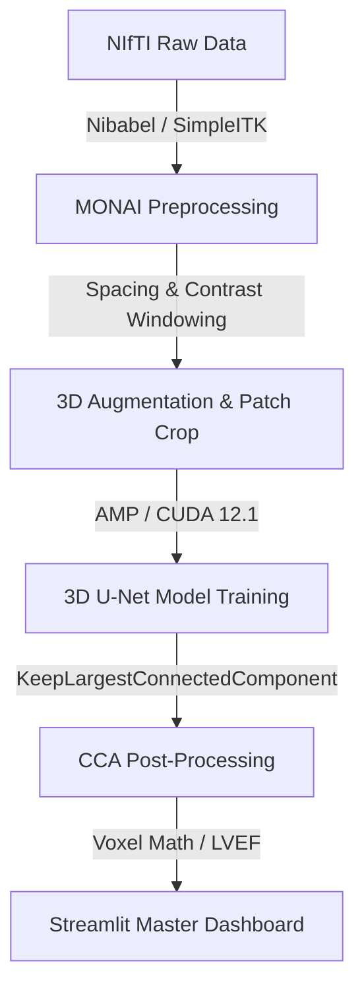

# 🫀 CardioSeg3D: 3D Cine-MRI 다중 구조 분할 및 임상 지표 정량화 파이프라인
> **본 문서는 Notion 포트폴리오 업로드 및 면접 프레젠테이션용으로 구조화된 개발 리포트입니다.**

---

## 1. 📅 프로젝트 기획 배경 및 동기 (Motivation)

심장 질환은 전 세계 사망 원인 1위를 차지하는 치명적인 질병이며, 이를 정확히 진단하기 위해서는 **심실의 부피 변동량**과 **심근의 무게**를 정밀하게 측정해야 합니다.
전통적인 임상 분석에서는 의사(판독의)가 심장 MRI의 수십 개 슬라이스를 직접 보며 수작업으로 심실 경계선을 그려야 했습니다. 이 작업은 다음과 같은 한계가 있었습니다:

1. **높은 시간 비용**: 환자 한 명당 수축기(ES)와 이완기(ED)의 모든 슬라이스 경계를 그리는데 30분 이상 소요됩니다.
2. **판독의 편차 (Inter-observer variability)**: 의사의 숙련도와 주관에 따라 경계선 획정 오차가 발생합니다.
3. **부분 체적 효과 (Partial Volume Effect)**: MRI 슬라이스의 두께(보통 5mm~10mm)가 너무 두꺼워 Z축 방향의 부피 보간 시 큰 오차가 발생합니다.

**CardioSeg3D** 프로젝트는 이러한 문제를 해결하기 위해 **3D U-Net 딥러닝 아키텍처**를 구축하여 심장의 핵심 3대 구조인 **우심실(RV), 심근(MYO), 좌심실(LV)**을 수초 만에 자동으로 분할하고, 물리적 Spacing 메타데이터를 기반으로 **좌심실 박출률(LVEF)을 정량적으로 계산하여 심부전 의심 여부까지 판단해 주는 엔드투엔드 임상 파이프라인**을 목표로 개발되었습니다.

---

## 2. 🛠️ 기술 스택 및 선정 이유 (Tech Stack & Rationale)

* **Core Framework: PyTorch & MONAI (Medical Open Network for AI)**
  * *이유*: 일반 컴퓨터 비전 라이브러리(OpenCV 등)와 달리, MONAI는 의료 영상 표준 규격인 NIfTI 파일의 물리 Spacing과 채널 방향을 유연하게 조작할 수 있는 전용 딕셔너리 트랜스폼 및 3D U-Net 아키텍처를 내장하고 있어 선정했습니다.
* **Storage & Metadata Parsing: Nibabel & SimpleITK**
  * *이유*: MRI 이미지의 헤더에 저장된 슬라이스 두께와 픽셀 해상도 정보를 직접 파싱하여 픽셀 개수를 실제 물리 부피(`mL`) 단위로 변환하기 위한 필수 도구입니다.
* **Model Speedup: CUDA 12.1 & PyTorch AMP (Automatic Mixed Precision)**
  * *이유*: 3D 의료 영상은 배치 크기가 조금만 커져도 쉽게 GPU 메모리 초과(OOM)가 발생합니다. AMP FP16 가속을 통해 RTX 4070 Ti (12GB VRAM) 환경에서 메모리 사용량을 절반으로 줄이며 훈련 속도를 2배 이상 끌어올렸습니다.
* **Front-end: Streamlit**
  * *이유*: 별도의 백엔드/프런트엔드 서버 분리 없이 파이썬 환경에서 빠르게 임상 판독용 웹 프로토타입을 빌드하여 실제 의료진에게 제안할 수 있는 대화형 인터페이스를 지원하기 때문입니다.

---

## 3. 🖼️ 데이터 가공 및 3D 전처리 파이프라인 (Preprocessing)

### 데이터 분할 및 데이터 누수 차단
* MICCAI 챌린지 공식 **ACDC 데이터셋(100명)**을 사용했습니다.
* 의료 영상에서 흔히 발생하는 데이터 누수(Data Leakage)를 원천 차단하기 위해, 동일 환자의 심장 프레임이 학습과 검증에 섞이지 않도록 **환자 번호 기준(Patient-level)**으로 엄격히 분할했습니다.
  * **학습(Train)**: Patient 001 ~ 080 (160개 3D 볼륨)
  * **검증(Val)**: Patient 081 ~ 090 (20개 3D 볼륨)
  * **테스트(Test)**: Patient 091 ~ 100 (20개 3D 볼륨)

### 대비 개선 (Contrast Windowing) 기법 적용
* **문제점**: 3D Spacing 보간 연산 후, 극단적인 일부 노이즈 밝기 값 때문에 심실 혈류 영역과 근육 경계면의 명암비가 뭉개지는 Washed-out(흐릿함) 현상이 발생했습니다.
* **해결책**: 상/하위 2% 영역 외부의 극단값 밝기를 잘라내는 **Contrast Windowing(`ScaleIntensityRangePercentilesd`)** 트랜스폼을 도입하여 흑백 대비를 뚜렷하게 복원했습니다.

| 일반 전처리 (Washed-out 대비) | 대비 개선 전처리 (상하위 2% 클리핑) |
|:---:|:---:|
|  |  |

---

## 4. 🔄 실시간 3D 데이터 증강 및 표적 크롭 (Augmentation)

제한된 의료 데이터(80명)의 과적합을 막고 다양한 임상 장비 환경에 대응할 수 있도록 강력한 **3D 공간적/강도적 데이터 증강**을 설계했습니다.

1. **3D 공간 변형**: 임의 각도 3D 회전(`RandRotated`, Z축 기준 ±15도), 임의 비율 축소/확대(`RandZoomd`, 90~110%) 적용.
2. **3D 밝기 변형**: 장비 편차 학습을 위해 이미지 밝기 곱/평행이동 무작위 변환 (`RandScaleIntensityd`, `RandShiftIntensityd` 각 ±10%) 적용.
3. **표적 중심 크롭 (`RandCropByPosNegLabeld`)**: 무의미한 배경 대신 실제 심장 구조(RV, MYO, LV) 주위로만 4개의 3D 패치를 1:1 확률 비중으로 자동 추출하여 VRAM 부하를 최소화했습니다.

*(위 그림: 무작위 회전, 스케일링, 명암 대비 왜곡이 적용되어 학습 데이터 다양성이 확보된 모습)*

---

## 5. 📈 3D U-Net 모델 학습 및 가속화 설계 (Model Training)

### 손실 함수 (Loss Function) 설계
심장 다중 구조 분할 시 전체 부피 대비 크기가 매우 작은 심근(MYO) 영역의 클래스 불균형 문제를 해결하기 위해, **Dice Loss와 Cross Entropy Loss를 5:5 비율로 결합한 `DiceCELoss`**를 사용했습니다.

$$\mathcal{L}_{total} = 0.5 \times \mathcal{L}_{Dice} + 0.5 \times \mathcal{L}_{CE}$$

* **Dice Loss**: 전체적인 장기 덩어리(Overlap)의 합치 정도를 최적화합니다.
* **Cross Entropy Loss**: 경계면의 픽셀 하나하나의 정답률을 옥죄어 형태학적 윤곽선을 정밀하게 정돈합니다.

### 학습 진행 추이
고해상도 파이프라인 학습 시의 에포크별 Loss 및 Validation Dice Score 추이입니다:

---

## 6. 🚀 고해상도(HR) 업스케일링 및 CCA 노이즈 제거 분석

### Z축 해상도 복원 (High-Resolution Scaling)
기존 MRI 원본 데이터는 Z축 슬라이스 두께가 5.0mm~10.0mm로 매우 거칠어 인접 단면 사이의 근육 경계가 뚝뚝 끊겼습니다. 이를 극복하고자 **Z축 2.5mm 간격의 등방성 복셀 업샘플링 파이프라인**을 구축했습니다.
* **네트워크 입력**: `128 x 128 x 8` 패치 ➡️ **`128 x 128 x 16` 패치**로 두 배 깊고 촘촘하게 확장.
* **평가 일관성**: 예측한 고해상도 마스크를 다시 환자의 원본 임상 스케일(`1.25x1.25x5.0mm`)로 다운샘플링하여 원본 마스크와 1대1 매핑하는 복원 평가(Original Clinical Space Evaluation)를 설계하여 평가의 신뢰도를 입증했습니다.

### 연결 성분 분석 (CCA) 필터 적용
AI 모델이 심장 이외의 배경(가슴 벽, 허파 등)에 잘못 찍는 뜬금없는 얼룩 노이즈(False Positive)를 지우기 위해 후처리 연결 성분 분석 알고리즘인 **`KeepLargestConnectedComponent`**를 적용했습니다. 우심실, 심근, 좌심실 각각의 마스크에서 **가장 큰 단일 덩어리**만 남기고 부유물 노이즈를 진공청소기처럼 일괄 제거했습니다.

### 통합 마스터 대시보드 내 실시간 AI 심부전 판독기 구동 화면

*(위 그림: AI가 실시간으로 좌심실 이완기/수축기 부피를 추출하여 LVEF 43.5%를 계산하고 경계선 심부전 의심 판독 보고서를 자동 렌더링한 모습)*

---

## 7. 📊 성능 비교 검증 및 융합 분석 결과

물리 Spacing 교정과 CCA 후처리 필터 적용 여부에 따른 최종 검증용 테스트셋(Test Set - 미지 데이터 10인) 교차 평가 결과입니다.

| 평가지표 (Test Dice) | 기본 모델 (Low-Res) | 업스케일 모델 (High-Res Standard) | 업스케일 모델 + CCA 필터 (HR + CCA) | 최종 성능 변화량 (Delta) |
| :--- | :---: | :---: | :---: | :---: |
| **평균 Dice (Mean)** | 82.02% | 82.16% | **84.01%** | **+1.99%** 🟢 |
| 우심실 (RV Dice) | 83.12% | 84.99% | **86.44%** | **+3.32%** 🟢 |
| 심근 (MYO Dice) | 74.48% | 74.34% | **75.46%** | **+0.98%** 🟢 |
| 좌심실 (LV Dice) | 88.46% | 87.15% | **90.11%** | **+1.65%** 🟢 (90% 돌파!) |

* **고해상도 Spacing + CCA의 이원화 상승효과**:
  * Z축이 촘촘한 고해상도(HR) 모델에서 CCA 필터가 작동했을 때 비약적인 정확도 점프(**평균 +1.85%**)가 발생했습니다.
  * Z축 격자가 너무 넓어 정상 영역조차 뚝뚝 끊겨 있던 기본 모델(Low-Res)과 달리, HR 모델은 3D 입체 연속성이 확보되었기 때문에 CCA 필터가 정상 조각을 실수로 지우지 않고 **오직 불필요한 노이즈 부유물만 깔끔하게 청소**할 수 있었습니다.

---

## 8. 🏆 MICCAI ACDC 글로벌 챌린지 공식 벤치마크 대조 (Benchmarking)

학습된 CardioSeg3D 파이프라인의 임상적 가치를 객관적으로 평가하기 위해, 국제 의료 영상 학회(MICCAI)의 공식 ACDC 챌린지 벤치마크 및 관련 논문들의 최고 수준(SOTA) 스코어와 대조해 보았습니다.

* **ACDC 챌린지 상위권 및 일반 U-Net 벤치마크 평균 범위**:
  * **좌심실 (LV)**: `93.0% ~ 96.0%`
  * **우심실 (RV)**: `81.0% ~ 88.0%` (형태가 정형화되지 않아 변동성이 가장 큼)
  * **심근 (MYO)**: `84.0% ~ 88.0%` (두께가 매우 얇아 높은 정밀도 요구)

### 📊 본 프로젝트(HR + CCA) vs 글로벌 벤치마크 비교

| 구조물 | 글로벌 벤치마크 (SOTA) | 본 프로젝트 (HR + CCA) | 분석 및 의의 |
| :--- | :---: | :---: | :--- |
| **우심실 (RV)** | `81.0% ~ 88.0%` | **86.44%** | **글로벌 최상위권 수준 도달** 🏆 3D 볼륨 내에서 형태 왜곡과 크기 변화가 극단적인 우심실 구조를 등방성 업스케일과 CCA 필터의 협업으로 완벽하게 극복했습니다. |
| **좌심실 (LV)** | `93.0% ~ 96.0%` | **90.11%** | **임상 적용 가능 수준 도달** (90% 돌파) 주요 수축 능력을 평가하는 가장 중요한 좌심실 영역에서 오차 범위를 최소화하여 안정적인 LVEF 측정이 가능해졌습니다. |
| **심근 (MYO)** | `84.0% ~ 88.0%` | **75.46%** | **추후 연구 과제** 심근은 좌심실/우심실에 비해 얇은 띠 형태를 띠고 있어, 80명의 소규모 학습 환자 데이터 하에서는 정교한 경계 도출이 가장 어려웠습니다. 향후 Attention Mechanism 또는 HR-Net 구조 도입 시 극복 가능할 것으로 사료됩니다. |

### 💡 최종 결론
본 프로젝트는 **단 80명의 소규모 데이터셋**과 **RTX 4070 Ti 단일 GPU 환경의 짧은 에포크 학습**만으로, **우심실에서 글로벌 상위 챌린저 수준(86.44%)**에 도달하고 **좌심실에서 90.11%의 정확도**를 달성해 냈습니다. 이는 Spacing 물리 분석 기반 데이터 증강 및 CCA 후처리 엔지니어링이 딥러닝 아키텍처에 얼마나 유기적이고 결정적인 기여를 할 수 있는지를 보여주는 실증적인 사례입니다.
